# Prva laboratorijska vježba: obrada slika, detekcija rubova i Houghova transformacija

U ovoj vježbi upoznat ćemo se s osnovama
obrade slika u Pythonu.
Prvo ćemo naučiti kako je slika prikazana u računalu
te kako je učitati, prikazati i jednostavno obraditi.
Zatim ćemo slike zaglađivati Gaussovim filtrom
i računati njihove derivacije,
što je temelj za detekciju rubova
Cannyjevim algoritmom
([članak](https://ieeexplore.ieee.org/abstract/document/4767851),
[wiki](https://en.wikipedia.org/wiki/Canny_edge_detector)).
Na kraju ćemo iz detektiranih rubova
Houghovom transformacijom
([wiki](https://en.wikipedia.org/wiki/Hough_transform))
pronaći pravce u slici.
Implementacije ovih algoritama dostupne su
u gotovo svim bibliotekama za računalni vid,
ali kako bismo ih bolje razumjeli,
u ovoj vježbi razvijamo vlastite implementacije.

Za vježbu će vam trebati sljedeći paketi:

```
pip install numpy scipy pooch pillow matplotlib opencv-python
```

Koristit ćemo biblioteke
[NumPy](https://numpy.org/doc/stable/user/absolute_beginners.html),
[SciPy](https://docs.scipy.org/doc/scipy/reference/ndimage.html)
(modul `scipy.ndimage` za konvoluciju),
[Pillow](https://pillow.readthedocs.io/en/stable/) (učitavanje slika),
[Matplotlib](https://matplotlib.org/) (prikaz)
i [OpenCV](https://docs.opencv.org/4.x/) (`cv2`).
Algoritme koje su tema vježbe (zaglađivanje, derivacije, Canny, Hough)
implementiramo sami, a OpenCV smijete koristiti samo
za pomoćne korake koji su izričito navedeni,
npr. za označavanje povezanih komponenata.
Prilikom implementacija pokušajte izbjegavati petlje u Pythonu,
a čim više koristite indeksiranje, rezanje
([slicing](https://numpy.org/doc/stable/user/basics.indexing.html))
i vektorizirane operacije biblioteke NumPy.

Osim ispitne slike rakuna iz paketa `scipy.datasets`,
u vježbi koristimo i sljedeće dvije slike
koje preuzmite i pohranite lokalno:


<br/><em>Slika 1. Ispitne slike `house.jpg` i `sudoku_gray.jpg`.</em>

[house.jpg](../assets/images/lab1/house.jpg),
[sudoku_gray.jpg](../assets/images/lab1/sudoku_gray.jpg)

## Zadatak 1: slika kao polje brojeva

Digitalna slika je pravokutna mreža piksela.
U Pythonu slike najčešće prikazujemo
višedimenzionalnim poljima biblioteke NumPy.
Siva slika je 2D polje oblika (H, W),
gdje je H visina (broj redaka), a W širina (broj stupaca) slike.
Slika u boji je 3D polje oblika (H, W, 3)
gdje treća os odgovara kanalima boje.
Element `img[r, c]` sadrži vrijednost piksela
u retku `r` i stupcu `c`.
Ishodište se nalazi u gornjem lijevom kutu slike,
indeksi redaka rastu prema dolje,
a indeksi stupaca prema desno.
Pri indeksiranju polja koordinate piksela zapisujemo
upravo u tom redoslijedu: (redak, stupac).

U računalnom vidu sliku se često idealizirano promatra kao kontinuiranu funkciju $$f(x,y) \rightarrow i$$, koja prostorne koordinate $$(x, y)$$ mapira na intenzitet $$i$$. Takav pristup omogućuje korištenje matematičkih alata i postupaka iz matematičke analize, linearne algebre ili obrade signala. Digitalna slika je tada diskretizirani slučaj, gdje su prostorne koordinate sada cijeli brojevi koji značavaju poziciju piksela. Uobičajeno je tada ishodište koordinantnog sustava postaviti gore-lijevo s $$x$$ osi koja raste prema desno, a $$y$$ osi koja raste prema dolje. Primijetite da u tome slučaju $$x$$ koordinata indeksira stupac, a $$y$$ koordinata redak polja kojim predstavljamo digitalnu sliku!

**a) Učitavanje slike, kanali boje i sive slike.**
Sljedeći kod dohvaća ispitnu sliku rakuna,
sprema je na disk, ponovno je učitava iz datoteke
i prikazuje na zaslonu.
Paket `scipy.datasets` sliku preuzima s interneta
pri prvom pozivu.
Napominjemo da starija funkcija `scipy.misc.face()`
nije dostupna u novijim verzijama SciPyja.

```
import numpy as np
import matplotlib.pyplot as plt
from PIL import Image
from scipy import datasets

img = datasets.face()
Image.fromarray(img).save("face.png")

img = np.array(Image.open("face.png"))
plt.imshow(img)
plt.show()
```

Ispišite `img.shape` i `img.dtype`.
Kolika je visina, a kolika širina slike i koliko slika ima kanala? 
Koji tip podataka koristimo za zapisivanje intenziteta slike? Koliko razina intenziteta jednog kanala možemo zapisati takvim tipom podatka? Koliko ukupno različitih boja možemo predstaviti uz takav tip podatka u prostoru RGB?
Ispišite vrijednost piksela u retku 100 i stupcu 200.
Koliko brojeva dobivate i što oni predstavljaju?

Prikažite crveni, zeleni i plavi kanal slike
kao tri zasebne sive slike jednu pored druge
(uputa: `plt.subplots` i argument `cmap="gray"`).
Zašto je lišće najsvjetlije u zelenom kanalu?

Primjer prikaza kanala boje:

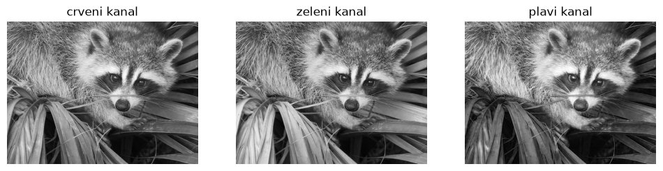
<br/><em>Slika 2. Crveni, zeleni i plavi kanal slike rakuna prikazani kao sive slike.</em>

Pretvorite sliku u sivu računanjem prosjeka kanala.
Kakav je oblik dobivenog polja?
Prikažite sivu sliku s argumentom `cmap="gray"` i bez njega.
Zašto slika bez tog argumenta nije siva?
Prosjek kanala je najjednostavnija pretvorba,
ali ljudsko oko nije jednako osjetljivo na sve boje.
Zato se češće koristi težinska suma kanala
([ITU-R BT.601](https://en.wikipedia.org/wiki/Luma_(video))).

Primjer slike u boji i sive slike dobivene prosjekom kanala:

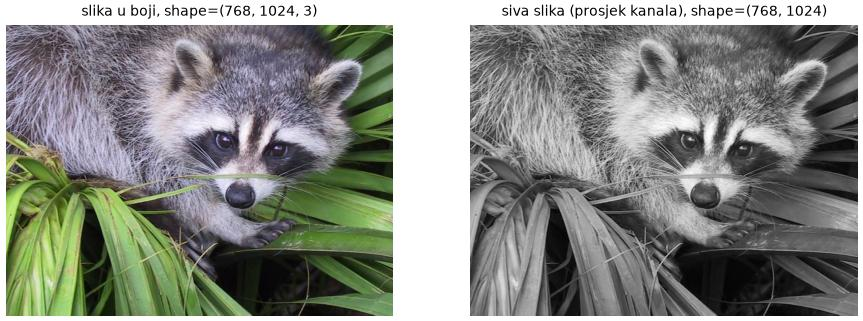
<br/><em>Slika 3. Slika rakuna u boji i siva slika dobivena prosjekom kanala.</em>

**b) Rezanje.**
Rezanjem (`img[r0:r1, c0:c1]`) izdvajamo pravokutne dijelove polja
bez petlji i bez kopiranja podataka.
Koristite rezanje kako biste prikazali
samo gornju polovicu slike,
a zatim samo lijevu polovicu.
Zrcalite sliku horizontalno
koristeći samo rezanje s negativnim korakom.
Sliku prikažite nakon svake operacije.

Rezanje možemo koristiti i na lijevoj strani pridruživanja
kako bismo promijenili samo dio slike.
Zamijenite redoslijed kanala iz RGB u BGR
samo u donjoj polovici slike,
tako da gornja polovica ostane nepromijenjena
Zašto se boje u donjoj polovici mijenjaju?

Primjer rezultata rezanja:

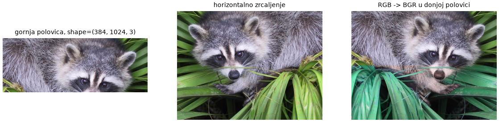
<br/><em>Slika 4. Gornja polovica slike, horizontalno zrcaljenje te zamjena redoslijeda kanala u donjoj polovici slike.</em>

**c) Aritmetika i tipovi podataka.**
Izračunajte `img + 100` i prikažite rezultat.
Zašto se na nekim mjestima pojavljuju neočekivane boje?
Ispišite vrijednosti jednog svijetlog piksela
prije i nakon zbrajanja.
Zatim ispravno posvijetlite sliku:
pretvorite je u tip float,
dodajte 100, ograničite vrijednosti na interval $$[0, 255]$$
(`np.clip`) i vratite rezultat u tip `np.uint8`.

Primjer zbrajanja s preljevom i ispravnog posvjetljivanja:

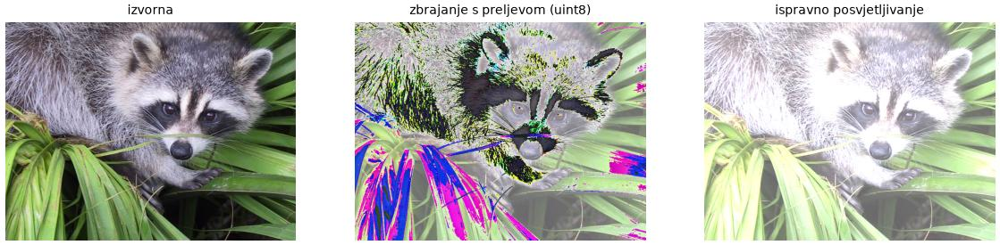
<br/><em>Slika 5. Slika rakuna nakon zbrajanja s preljevom i nakon ispravnog posvjetljivanja.</em>

## Zadatak 2: konvolucija, Gaussovo zaglađivanje i derivacije slike

### Konvolucija

Većina osnovnih postupaka obrade slika
(zaglađivanje, izoštravanje, računanje derivacija)
pripada _linearnom filtriranju_:
vrijednost svakog elementa izlaznog signala
je linearna kombinacija elemenata
njegove okoline u ulaznom signalu.
Težine te kombinacije zadane su malim poljem
koje nazivamo _jezgrom_ (engl. kernel),
a sama operacija naziva se _konvolucija_.

Promotrimo najprije jednodimenzionalni slučaj.
Neka je $$I$$ diskretni signal (niz brojeva),
a $$K$$ jezgra s neparnim brojem elemenata $$k$$,
indeksiranih od $$-\lfloor k/2 \rfloor$$ do $$\lfloor k/2 \rfloor$$
tako da je ishodište jezgre u njenom središtu.
Konvolucija signala i jezgre definirana je kao:

$$(I * K)(x) = \sum_{i=-\lfloor k/2 \rfloor}^{\lfloor k/2 \rfloor} K(i)\, I(x - i) \ .$$

Element izlaza na položaju $$x$$ dobivamo tako da
jezgru centriramo na element $$I(x)$$,
pomnožimo elemente jezgre s pripadnim elementima signala
i umnoške zbrojimo. Zbog negativnog predznaka prilikom indeksiranja signala, jezgru je potrebno zrcaliti prije izračuna odgovarajućih umnožaka. Na rubovima signala dio jezgre pada izvan signala,
pa signal moramo proširiti (engl. padding) nulama, zrcaljenjem ili ponavljanjem rubnih elemenata.

Animacija ispod prikazuje konvoluciju signala od osam elemenata
jezgrom $$K = [1, 0, -1]$$ (tj. $$K(-1) = 1$$, $$K(0) = 0$$, $$K(1) = -1$$):
zrcaljena jezgra klizi po signalu,
a svaki element izlaza je suma umnožaka
elemenata jezgre i pripadnih elemenata signala
(rub signala proširen je nulama):

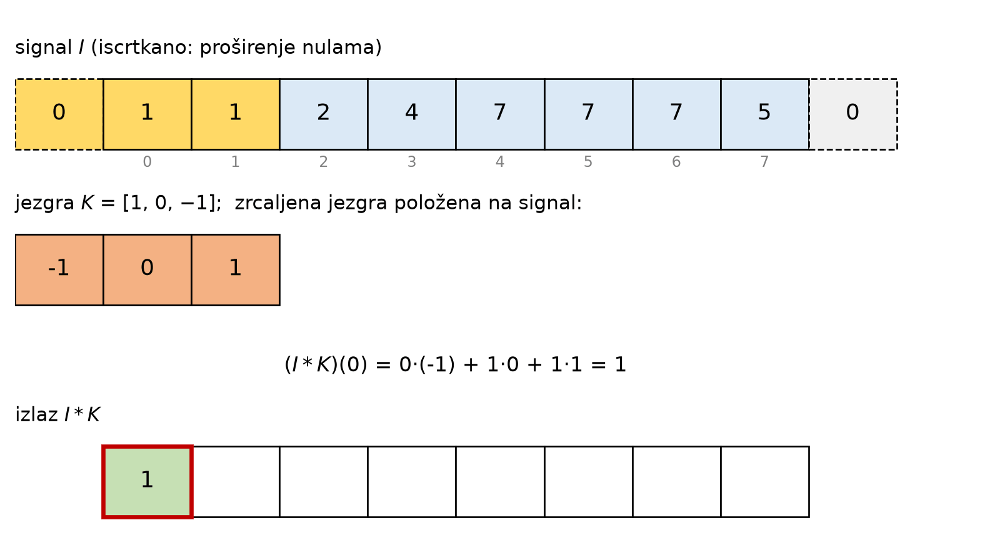
<br/><em>Slika 6. Animacija 1D konvolucije jezgrom $$K = [1, 0, -1]$$: zrcaljena jezgra klizi po signalu proširenom nulama.</em>

*Opaska*: Srodna operacija bez zrcaljenja jezgre,
$$\sum_i K(i)\, I(x + i)$$,
naziva se _unakrsna korelacija_.
Za simetrične jezgre obje operacije daju isti rezultat,
ali za nesimetrične jezgre (npr. jezgre za deriviranje)
razlika je bitna. Osim toga, konvolucija je komutativna i asocijativna, a unakrsna korelacija nije. To su važna svojstva na koja se oslanjaju neki algoritmi računalnog vida. Duboko učenje donijelo je dodatnu zabunu. Kod dubokih modela  jezgre se uče, pa bi modeli jednako dobro radili u obje inačice ove operacije (sve dok smo konzistentni prilikom treniranja i zaključivanja). Precizno imenovanje je postalo još manje bitno, pa tako u Pytorchu konvolucijski sloj [nn.Conv2d](https://docs.pytorch.org/docs/2.14/generated/torch.nn.Conv2d.html) zapravo obavlja unakrsnu korelaciju.

Slika je dvodimenzionalni signal,
pa je i jezgra dvodimenzionalno polje
s ishodištem u središtu,
a konvolucija sive slike $$I$$ i jezgre $$K$$ glasi:

$$(I * K)(x, y) = \sum_{i}\sum_{j} K(i, j)\, I(x - i, y - j) \ ,$$

gdje indeksi $$i$$ i $$j$$ prolaze kroz sve elemente jezgre.
Jezgra se sada zrcali po obje osi,
a sliku na rubovima proširujemo na isti način kao i signal.

Konvolucija je linearna
($$(aI_1 + bI_2) * K = a(I_1 * K) + b(I_2 * K)$$),
komutativna ($$I * K = K * I$$) i asocijativna
($$(I * K_1) * K_2 = I * (K_1 * K_2)$$).
Iz asocijativnosti slijedi da dvije uzastopne konvolucije
možemo zamijeniti jednom konvolucijom s jezgrom $$K_1 * K_2$$
i obrnuto, što ćemo iskoristiti u nastavku.

### Gaussovo zaglađivanje

Za zaglađivanje i uklanjanje šuma u slici
najčešće ćemo koristiti konvoluciju s Gaussovom jezgrom
kojoj težine padaju s udaljenošću od središta:

$$I_b = I * G; \quad G(x, y) = \frac{1}{2\pi\sigma^2}\exp\left(-\frac{x^2 + y^2}{2\sigma^2}\right) \ .$$

Parametar $$\sigma$$ (standardna devijacija)
određuje širinu jezgre, a time i jačinu zaglađivanja.
Gaussova funkcija nikad ne pada na nulu,
pa je zbog efikasnosti u praksi odrežemo:
jezgru uzorkujemo u cjelobrojnim točkama
na intervalu $$[-\lceil 3\sigma \rceil, \lceil 3\sigma \rceil]$$,
izvan kojeg su vrijednosti zanemarive,
te je normaliziramo tako da joj suma bude 1
kako konvolucija ne bi mijenjala prosječnu svjetlinu slike.

Dvodimenzionalna Gaussova jezgra
može se zapisati kao umnožak
dviju jednodimenzionalnih jezgri:

$$G(x, y) = g(x)\, g(y), \qquad
  g(x) = \frac{1}{\sqrt{2\pi}\sigma}\exp\left(-\frac{x^2}{2\sigma^2}\right) \ .$$

Zbog asocijativnosti konvolucije
zaglađivanje zato možemo provesti
kao dvije uzastopne 1D konvolucije:
$$I_b = (I * g(x)) * g(y)$$,
najprije po jednoj, a zatim po drugoj osi.
Takav _separabilni_ postupak zahtijeva
$$2k$$ umjesto $$k^2$$ operacija po izlaznom pikselu
i znatno je brži od konvolucije s 2D jezgrom.

**a) Gaussova jezgra.**
Napišite funkciju `gauss(sigma)`
koja vraća 1D Gaussovu jezgru kao NumPy polje
duljine $$2\lceil 3\sigma \rceil + 1$$,
uzorkovanu prema gornjoj formuli i normaliziranu na sumu 1.
Ispišite jezgru za $$\sigma = 1$$
i provjerite da je simetrična i da joj je suma 1.
Nacrtajte jezgre za $$\sigma \in \{1, 2, 4\}$$
(uputa: `plt.plot` s odgovarajućim vrijednostima $$x$$ na apscisi).
Kako $$\sigma$$ utječe na širinu i visinu jezgre?
Što bi se dogodilo kad bismo jezgru odrezali
već na $$\pm\sigma$$?

Primjer jezgri:

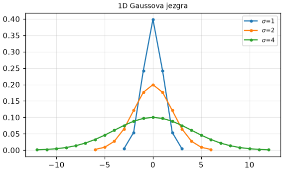
<br/><em>Slika 7. 1D Gaussova jezgra za $$\sigma \in \{1, 2, 4\}$$.</em>

**b) Zaglađivanje.**
Učitajte sliku `house.jpg`, pretvorite je u sivu
i u tip `float` (uputa:
[ndarray.astype](https://numpy.org/doc/stable/reference/generated/numpy.ndarray.astype.html)),
kako bismo izbjegli preljev u daljnjim operacijama.
Napišite funkciju `smooth(img, sigma)`
koja sliku zaglađuje separabilno,
dvjema uzastopnim 1D konvolucijama.
Za 1D konvoluciju duž jedne osi slike
koristite funkciju
[ndimage.convolve1d](https://docs.scipy.org/doc/scipy/reference/generated/scipy.ndimage.convolve1d.html)
s argumentom `axis`
(`axis=1` je konvolucija po $$x$$, tj. duž redaka,
a `axis=0` po $$y$$).
Prikažite rezultate zaglađivanja
za nekoliko vrijednosti argumenta `sigma`.
Kako vrijednost toga argumenta utječe na rezultat?

Primjer zaglađivanja:

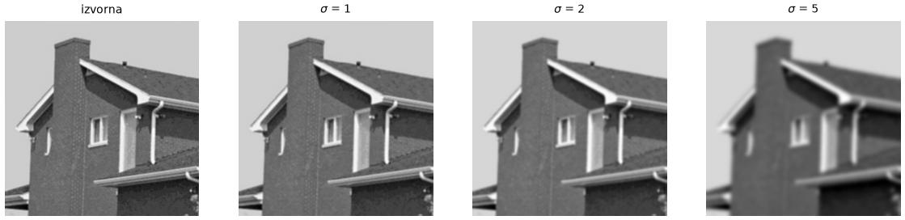
<br/><em>Slika 8. Zaglađivanje slike kuće za tri vrijednosti sigme.</em>

### Derivacije slike

Još jedna osnovna operacija koju izvodimo konvolucijom je derivacija slike. 
Sliku možemo promatrati kao funkciju $$I(x, y)$$
koja svakoj točki pridružuje intenzitet,
pa nam njezine parcijalne derivacije
$$I_x = \frac{\partial I}{\partial x}$$ i $$I_y = \frac{\partial I}{\partial y}$$
govore koliko se brzo intenzitet mijenja
u vodoravnom, odnosno okomitom smjeru.
Vektor $$\nabla I = (I_x, I_y)$$ nazivamo _gradijentom_ slike.
Duljina (magnituda) toga vektora $$\sqrt{I_x^2 + I_y^2}$$ 
bit će velika u područjima gdje se intenzitet slike naglo mijenja poput rubova objekata,
a približno nula na jednolikim područjima.
Smjer gradijenta bit će okomit na rub i pokazivati u smjeru najbržeg rasta intenziteta.

Slika je diskretna, pa ćemo derivaciju aproksimirati _konačnim razlikama_.
Najjednostavnija aproksimacija derivacija po $$x$$ i $$y$$ je razlika susjednih piksela:

$$I_x(x, y) \approx I(x+1, y) - I(x, y) \ , \qquad I_y(x, y) \approx I(x, y+1) - I(x, y) \ .$$

Primijetite da bismo u programskom kodu pisali `Ix[r, c] = I[r, c+1] - I[r, c]` i `Iy[r, c] = I[r+1, c] - I[r, c]` zbog orijentacije koordinatnog sustava kako smo opisali ranije. Ovakav izračun derivacije možemo postići konvolucijom
s malom 1D jezgrom $$[1, -1]$$ (zrcaljenje!).

U praksi se derivacije često računaju [Sobelovim operatorom](https://en.wikipedia.org/wiki/Sobel_operator),
koji umjesto razlike dvaju piksela koristi malu $$3 \times 3$$ jezgru.
Za derivaciju po $$x$$ ona računa centralnu razliku
$$I(x+1, y) - I(x-1, y)$$ u retku piksela i u dva susjedna retka,
pri čemu središnji redak ima dvostruku težinu:

$$S_x = \begin{bmatrix} -1 & 0 & 1 \\ -2 & 0 & 2 \\ -1 & 0 & 1 \end{bmatrix} , \qquad
  S_y = S_x^\top = \begin{bmatrix} -1 & -2 & -1 \\ 0 & 0 & 0 \\ 1 & 2 & 1 \end{bmatrix} \ .$$

Jezgre su zapisane tako da ih se primjenjuje korelacijom,
pa ih za konvoluciju treba zrcaliti.
Uprosječivanje okomito na smjer deriviranja
čini Sobelov operator nešto otpornijim na šum
od obične razlike susjednih piksela.

U svakom slučaju, derivacija slike ostaje osjetljiva na šum jer
i mala slučajna odstupanja u intenzitetu daju veliki iznos derivacije.
Zato sliku prije deriviranja zaglađujemo, i to najčešće Gaussovom jezgrom.

Parcijalnu derivaciju _zaglađene_ slike po $$x$$
stoga možemo zapisati kao:

$$I_x = \frac{\partial}{\partial x}\Big[g(x) * g(y) * I\Big] \ .$$


Primijetite da smo za Gaussovo zaglađivanje iskoristili svojstvo separabilnosti jezgre.     

Derivaciju također izvodimo konvolucijom pa vrijedi svojstvo asocijativnosti,
što nam dopušta da derivaciju prebacimo na jezgru $$g(x)$$:

$$I_x = \frac{\partial}{\partial x}\Big[g(x) * \big(g(y) * I\big)\Big]
    = \underbrace{\Big(\frac{d}{dx}g(x)\Big)}_{\text{derivacija jezgre}} * \underbrace{\big(g(y) * I\big)}_{\text{zaglađivanje po } y} \ .$$


Dakle, derivaciju po x zaglađene slike postižemo prvo zaglađivanjem slike Gaussovom jezgrom po $$y$$,
a rezultat zatim konvoluiramo s deriviranom Gaussovom jezgrom po $$x$$. 
Deriviranu gaussovu jezgru dobit ćemo uzorkovanjem sljedeće analitički dobivene funkcije: 

$$\frac{d}{dx}g(x) = -\frac{1}{\sqrt{2\pi}\sigma^3}\, x \exp\left(-\frac{x^2}{2\sigma^2}\right) \ .$$

Druge derivacije dobivamo ponovnom primjenom istog postupka
na već izračunatu prvu derivaciju,
npr. $$I_{xx} = \frac{d}{dx}g(x) * \big[g(y) * I_x\big]$$.
Za vježbu raspišite izraze za $$I_y$$, $$I_{yy}$$
i miješanu derivaciju $$I_{xy}$$.

**c) Derivacija Gaussove jezgre.**
Napišite funkciju `gaussdx(sigma)`
koja vraća derivaciju Gaussove jezgre,
uzorkovanu prema gornjoj formuli
u istim točkama kao i `gauss`.
Derivacija je neparna funkcija pa joj je suma nula
i ne možemo je normalizirati na isti način kao Gaussovu jezgru.
Normalizacija ovdje nije ni potrebna:
konstanta u formuli već daje ispravnu skalu,
pa konvolucija s `gaussdx` vraća približno
stvarnu derivaciju slike u jedinicama intenziteta po pikselu.
Nacrtajte jezgre za $$\sigma \in \{1, 2, 4\}$$.

Primjer jezgri:

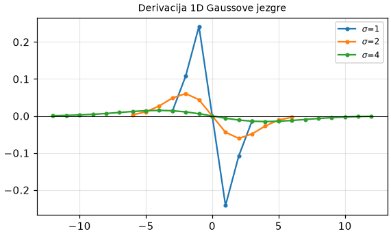
<br/><em>Slika 9. Derivacija 1D Gaussove jezgre za $$\sigma \in \{1, 2, 4\}$$.</em>

**d) Impulsni odziv.**
Svojstva filtra možemo proučiti
promatranjem njegovog _impulsnog odziva_,
tj. rezultata konvolucije sa
slikom kojoj su svi elementi nula
osim središnjeg koji je jedan.

```
impulse = np.zeros((50, 50))
impulse[25, 25] = 1
```

Generirajte jezgre `G = gauss(5)` i `D = gaussdx(5)`.
Indeksom označavamo os po kojoj jezgru primjenjujemo:
$$G_x$$ i $$D_x$$ označavaju 1D konvoluciju po $$x$$ (`axis=1`),
a $$G_y$$ i $$D_y$$ 1D konvoluciju po $$y$$ (`axis=0`).
Prikažite impulsne odzive
za sljedeće redoslijede operacija:

1. prvo $$G_x$$, zatim $$G_y$$,
2. prvo $$G_x$$, zatim $$D_y$$,
3. prvo $$D_x$$, zatim $$G_y$$,
4. prvo $$G_y$$, zatim $$D_x$$,
5. prvo $$D_y$$, zatim $$G_x$$.

Je li redoslijed operacija važan? Zašto?
Koji od tih odziva odgovara operatoru $$\partial / \partial x$$,
a koji operatoru $$\partial / \partial y$$?

Primjer impulsnih odziva:

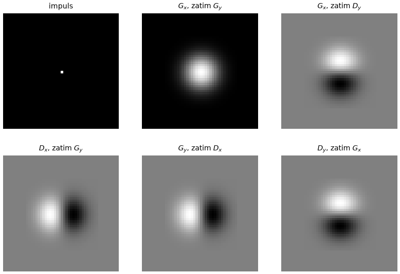
<br/><em>Slika 10. Impulsni odzivi za različite redoslijede konvolucija Gaussovom jezgrom i njezinom derivacijom.</em>

**e) Derivacije slike.**
Napišite funkciju `image_derivatives(img, sigma)`
koja pomoću `gauss` i `gaussdx`
vraća parcijalne derivacije $$I_x$$ i $$I_y$$ zadane slike.
Zatim napišite funkciju `gradient_magnitude(img, sigma)`
koja vraća iznos gradijenta
$$m = \sqrt{I_x^2 + I_y^2}$$
i smjer gradijenta
$$\phi = \arctan(I_y / I_x)$$
(uputa: koristite `np.arctan2(Iy, Ix)`
kako biste izbjegli dijeljenje s nulom
i dobili kut u punom rasponu $$[-\pi, \pi]$$).
Prikažite sve izračunate slike za `house.jpg`.
Derivacije imaju predznak,
a `imshow` najmanju vrijednost prikazuje crnom, a najveću bijelom,
pa su područja bez promjene intenziteta, gdje je derivacija nula, siva,
porast intenziteta svjetliji, a pad tamniji.

Primjer derivacija:

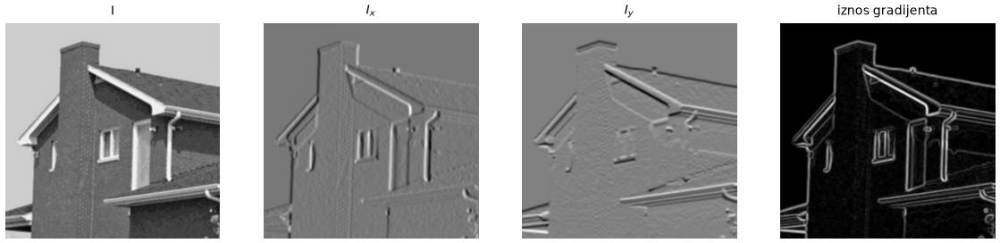
<br/><em>Slika 11. Parcijalne derivacije $$I_x$$ i $$I_y$$ te iznos gradijenta slike kuće.</em>

## Zadatak 3: Cannyjev detektor rubova

Cannyjev algoritam jedan je od najkorištenijih
algoritama za detekciju rubova.
Ulaz algoritma je siva slika,
a izlaz binarna slika u kojoj su
pikseli rubova označeni jedinicom.
Algoritam se sastoji od tri koraka:
zaglađivanje i računanje gradijenta,
potiskivanje nemaksimalnih odziva duž smjera gradijenta
te uspoređivanje s dva praga i povezivanje rubova histerezom.
Prvi korak već imamo iz prethodnog zadatka.
Prije toga ćemo isprobati najjednostavniji detektor rubova,
uspoređivanje iznosa gradijenta s jednim pragom,
kako bismo vidjeli zašto su preostala dva koraka potrebna.

**a) Iznos gradijenta i prag.**
Napišite funkciju `findedges(img, sigma, theta)`
koja računa iznos gradijenta zaglađene slike
te zadržava samo piksele
čiji je iznos veći ili jednak pragu `theta`,
a ostale postavlja na nulu:

$$I_e(x, y) =
  \cases{ m(x, y) & ; \ m(x, y) \geq \theta \cr
          0       & ; \ \mathrm{inače} }$$

Prije uspoređivanja s pragom
normalizirajte iznos gradijenta na interval $$[0, 255]$$,
tako da ga podijelite s najvećom vrijednosti u polju
i pomnožite s 255.
Tako pragovi ne ovise o rasponu intenziteta ulazne slike.
Prikažite rezultat za sliku `house.jpg`
i nekoliko vrijednosti praga.
Možete li prag postaviti tako da su
svi rubovi u slici jasno vidljivi,
a da pritom ne dobijete previše
lažnih detekcija?

Primjer:

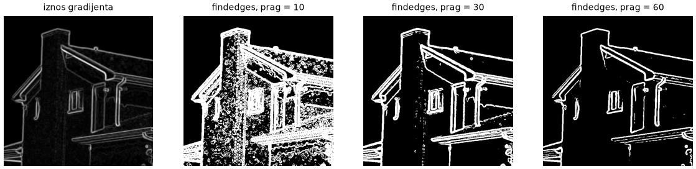
<br/><em>Slika 12. Normalizirani iznos gradijenta slike kuće i rezultat uspoređivanja s tri praga.</em>

**b) Potiskivanje nemaksimalnih odziva.**
Rubovi dobiveni pragom su široki nekoliko piksela,
a mi želimo rubove debljine jednog piksela.
Cannyjev algoritam zato potiskuje odzive
koji nisu lokalni maksimum
u susjedstvu koje se proteže _duž smjera gradijenta_.
Postupak provodimo na sljedeći način.
U svakom pikselu očitamo kut gradijenta
te prema njemu odredimo
jedan od četiri diskretna pravca:
horizontalni, vertikalni ili jedan od dva dijagonalna.
Susjedstvo čine dva nasuprotna piksela
koja leže na tom pravcu.
Primjerice, prema slici ispod,
ako za kut $$\theta$$ vrijedi
$$22.5^{\circ} < \theta < 67.5^{\circ}$$ ili
$$-157.5^{\circ} < \theta < -112.5^{\circ}$$,
tada susjedstvo čine pikseli dolje-desno i gore-lijevo.
Pri programskoj implementaciji vrijedi obratiti pažnju na
raspon vrijednosti koje vraća `np.arctan2`
te na koordinatni sustav slike
(npr. kut od $$45^{\circ}$$ u slici pokazuje dolje-desno). Za pomoć pogledajte sliku ispod.

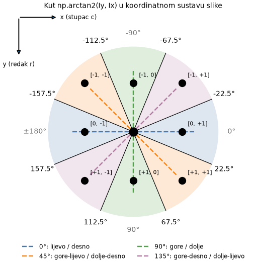
<br/><em>Slika 13. Diskretizacija smjera gradijenta u koordinatnom sustavu slike.</em>

Piksel će preživjeti potiskivanje samo ako je njegov iznos gradijenta
veći ili jednak iznosima obaju susjeda;
inače se postavlja na nulu.
Ovakav postupak za posljedicu ima
_stanjivanje_ rubova.

Implementirajte opisani postupak
u funkciji `nms_gradient(mag, angle)`. 
Pripazite da promjene ne radite izravno na polju kojeg čitate jer to dovodi do pogreške (u kojem slučaju?).
Prikažite iznose gradijenta
prije i nakon potiskivanja.

Primjer iznosa gradijenta prije i nakon potiskivanja
(donji red prikazuje uvećani isječak označen crvenim okvirom):

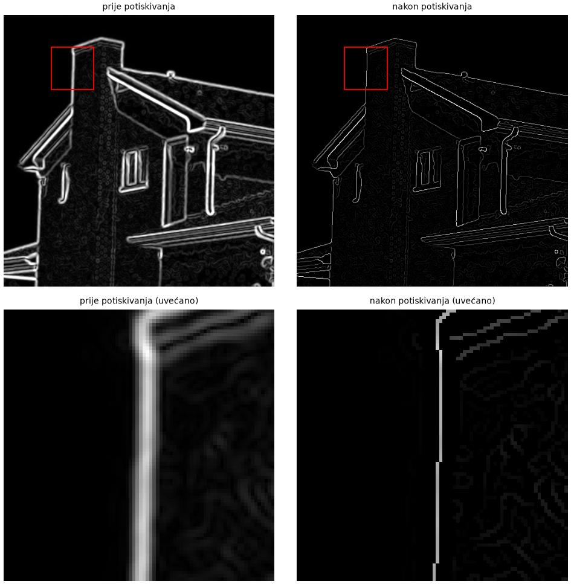
<br/><em>Slika 14. Iznos gradijenta prije i nakon potiskivanja nemaksimalnih odziva; donji red prikazuje uvećani isječak označen crvenim okvirom.</em>

**c) Uspoređivanje s dva praga - histereza.**
U posljednjem koraku algoritam donosi konačnu odluku
koji od piksela zaista jesu rubovi.
To činimo uspoređivanjem s dva praga,
donjim `low` i gornjim `high`.
Svi pikseli čiji je iznos veći od gornjeg praga
čine _jake_ rubove.
Piksele čiji je iznos manji od donjeg praga
odbacujemo.
Piksele čiji se iznos nalazi između dva praga
smatramo _slabim_ rubovima,
a odluku o njima donosimo
na temelju povezanosti:
slabi rub zadržavamo samo ako je
(preko drugih slabih rubova)
povezan s nekim jakim rubom.

Implementirajte histerezu u funkciji
`hysteresis(mag_nms, low, high)`.
Uputa: Proučite algoritam povezanih komponenti [cv2.connectedComponents](https://docs.opencv.org/4.x/d3/dc0/group__imgproc__shape.html#gaedef8c7340499ca391d459122e51bef5).
Pronađite povezane komponente
binarne slike `mag_nms >= low`,
te zadržite samo one komponente
koje sadrže barem jedan jaki piksel.

Sve korake objedinite u funkciji
`canny(img, sigma, low, high)`
koja vraća binarnu sliku rubova.
Prikažite sve međurezultate za sliku `house.jpg`:
iznos gradijenta, iznos nakon potiskivanja,
samo jake rubove te konačan rezultat.
Zatim algoritam primijenite i na sliku `sudoku_gray.jpg`.
Kako parametri `sigma`, `low` i `high`
utječu na rezultat?

Primjer međurezultata za `house.jpg`
(`sigma=1.5`, `low=10`, `high=90`):

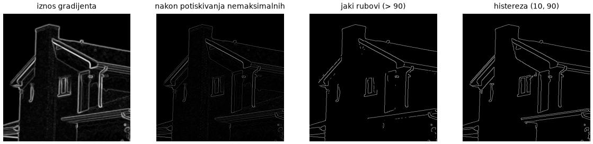
<br/><em>Slika 15. Međurezultati Cannyjevog algoritma na slici kuće (`sigma=1.5`, `low=10`, `high=90`).</em>

Primjer za `sudoku_gray.jpg`
(`sigma=2.0`, `low=20`, `high=60`):

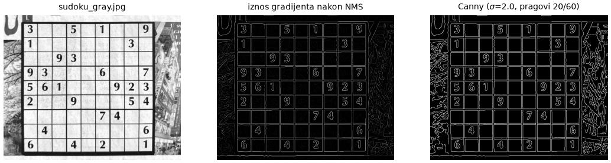
<br/><em>Slika 16. Rezultat Cannyjevog algoritma na slici sudokua (`sigma=2.0`, `low=20`, `high=60`).</em>

## Zadatak 4: Houghova transformacija za detekciju pravaca

Nakon što smo pronašli rubne piksele,
želimo u njima prepoznati jednostavne strukture,
u našem slučaju pravce.
Za to ćemo koristiti Houghovu transformaciju.
Više o teoriji možete pronaći na predavanjima,
a postupak si možete predočiti i
[interaktivnim demom](https://www.aber.ac.uk/~dcswww/Dept/Teaching/CourseNotes/current/CS34110/hough.html).

Promotrimo točku $$t_0 = (x_0, y_0)$$ u slici.
Ako pravac zapišemo standardnom jednadžbom $$y = kx + l$$,
koji sve pravci prolaze kroz $$t_0$$?
To su svi pravci čiji parametri $$k$$ i $$l$$
zadovoljavaju $$y_0 = k x_0 + l$$.
Ako fiksiramo $$(x_0, y_0)$$,
ta jednadžba u prostoru parametara $$(k, l)$$
ponovno opisuje pravac:

$$l = -x_0 k + y_0 \ ,$$

s nagibom $$-x_0$$ i odsječkom $$y_0$$.
Druga točka $$t_1 = (x_1, y_1)$$ u prostoru parametara
također određuje pravac, $$l = -x_1 k + y_1$$,
a sjecište tih dvaju pravaca $$(k', l')$$
odgovara pravcu u slici koji prolazi kroz $$t_0$$ i $$t_1$$.
Houghova transformacija taj uvid pretvara u postupak _glasanja_:
svaki rubni piksel glasa za sve pravce koji kroz njega prolaze,
a glasove skupljamo u diskretiziranom prostoru parametara
koji nazivamo _akumulatorom_.
Ćelije akumulatora s najviše glasova
odgovaraju parametrima pravaca u slici.

Za vježbu riješite analitički:
zadane su točke $$(0, 0)$$, $$(1, 1)$$, $$(1, 0)$$ i $$(2, 2)$$.
Nacrtajte njihove pravce u prostoru $$(k, l)$$
i odredite jednadžbe pravaca
koji prolaze kroz barem dvije od tih točaka.

Parametrizacija $$y = kx + l$$ nije prikladna za glasanje
jer za vertikalne pravce $$k$$ teži u beskonačnost.
Zato pravce parametriziramo _polarno_:

$$x \cos\theta + y \sin\theta = \rho \ .$$

Pravac nam sada određuju parametri $$\rho$$ - okomita udaljenost pravca od ishodišta,
te $$\theta$$ - kut između osi $$x$$ i okomice na pravac. Dakle, svakom pravcu u slici odgovara jedna točka $$(\theta, \rho)$$.
Skup svih pravaca koji prolaze kroz točku $$t_0 = (x_0, y_0)$$
u prostoru parametara $$(\theta, \rho)$$ više nije pravac, nego sinusoida:

$$\rho(\theta) = x_0 \cos\theta + y_0 \sin\theta \ .$$

Svakoj vrijednosti kuta $$\theta$$ odgovara točno jedan pravac kroz $$t_0$$,
a jednadžba daje njegovu udaljenost $$\rho$$ od ishodišta.
Amplituda sinusoide jednaka je udaljenosti točke $$t_0$$ od ishodišta.


Za implementaciju moramo odabrati
raspon parametara i veličinu akumulatora.
Kut $$\theta$$ definiramo na intervalu $$[-\pi/2, \pi/2)$$
jer su pravci neusmjereni,
a $$\rho$$ na intervalu $$[-D, D]$$,
gdje je $$D$$ duljina dijagonale slike,
jer pravci udaljeniji od ishodišta
ne prolaze kroz sliku.
Za parametar $$\rho$$ moramo uzeti u obzir i negativne vrijednosti
jer smo raspon kuta $$\theta$$ ograničili, 
pa će predznak od $$\rho$$ otkrivati s koje se strane ishodišta pravac nalazi
gledano u smjeru normale $$(\cos\theta, \sin\theta)$$.

Hiperparametri algoritma su rezolucije akumulatora
`num_bins_theta` i `num_bins_rho`.
Kod glasanja piksela $$(x, y)$$
prolazimo kroz sve diskretne vrijednosti $$\theta$$,
za svaku iz gornje jednadžbe izračunamo $$\rho$$,
zaokružimo ga na najbliži pretinac
i odgovarajuću ćeliju akumulatora uvećamo za jedan.

Diskretne vrijednosti parametara možemo zadati ovako:

```python
D = np.sqrt(H**2 + W**2)
thetas = np.linspace(-np.pi / 2, np.pi / 2, num_bins_theta, endpoint=False)
rhos = np.linspace(-D, D, num_bins_rho)
```

Stupac akumulatora određuje indeks kuta u polju `thetas`.
Redak dobivamo linearnim preslikavanjem intervala $$[-D, D]$$
na indekse od $$0$$ do `num_bins_rho - 1`
i zaokruživanjem na najbliži cijeli broj:

$$i_\rho = \mathrm{round}\left(\frac{\rho + D}{2D} \, (\texttt{num\_bins\_rho} - 1)\right) \ .$$

Tako vrijednost $$\rho = -D$$ pada u prvi redak,
$$\rho = D$$ u posljednji,
a svaka druga vrijednost u redak čija je vrijednost u polju `rhos` najbliža.
Sve vrijednosti $$\rho$$ za jedan piksel
možete izračunati odjednom za cijelo polje `thetas`.

**a) Jedna točka.**
Napravite prazan akumulator veličine
`num_bins_rho` $$\times$$ `num_bins_theta`
te crnu sliku veličine $$100\times100$$
s jednim bijelim pikselom, npr. u $$(x, y) = (50, 90)$$.
Izračunajte sinusoidu koja predstavlja
sve pravce kroz tu točku
i uvećajte odgovarajuće ćelije akumulatora.
Prikažite akumulator.
Zatim s funkcijom `draw_line` implementiranom ispod, nacrtajte
nekoliko pravaca iz akumulatora preko slike
i uvjerite se da svi prolaze kroz zadanu točku.
Eksperimentirajte s položajem točke
i rezolucijom akumulatora.

Za iscrtavanje pravca zadanog parametrima $$(\rho, \theta)$$
preko slike visine `H` i širine `W`
možete koristiti sljedeću pomoćnu funkciju
koja računa sjecišta pravca s rubovima slike:

```
def draw_line(rho, theta, H, W, ax=None, **kw):
    ax = ax or plt.gca()
    c, s = np.cos(theta), np.sin(theta)
    pts = []
    if abs(s) > 1e-9:                       # sjecista s lijevim i desnim rubom
        for x in (0, W - 1):
            y = (rho - x * c) / s
            if -1 <= y <= H: pts.append((x, y))
    if abs(c) > 1e-9:                       # sjecista s gornjim i donjim rubom
        for y in (0, H - 1):
            x = (rho - y * s) / c
            if -1 <= x <= W: pts.append((x, y))
    if len(pts) >= 2:                       # dvije najudaljenije tocke
        pts = np.array(pts)
        d = ((pts[:, None] - pts[None]) ** 2).sum(-1)
        i, j = np.unravel_index(np.argmax(d), d.shape)
        ax.plot([pts[i, 0], pts[j, 0]], [pts[i, 1], pts[j, 1]], scalex=False, scaley=False, **kw)
```

Primjer:

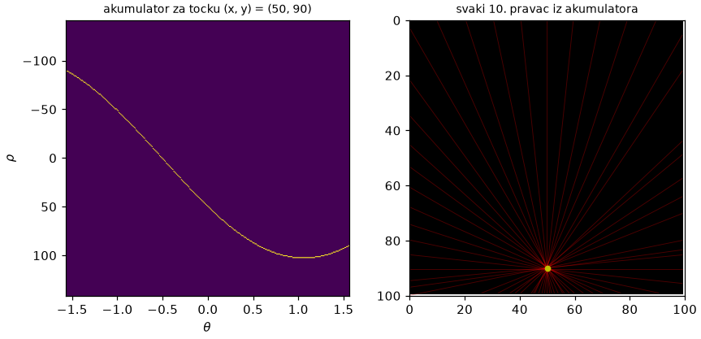
<br/><em>Slika 17. Akumulator Houghove transformacije za jednu točku slike i pravci koji pripadaju pojedinim ćelijama akumulatora.</em>

**b) Akumulator za binarnu sliku.**
Napišite funkciju
`hough_find_lines(edges, num_bins_theta, num_bins_rho)`
koja za binarnu sliku rubova vraća akumulator
te vektore diskretnih vrijednosti `thetas` i `rhos`.
Koordinate piksela rubova možete dohvatiti funkcijom
[np.nonzero](https://numpy.org/doc/stable/reference/generated/numpy.nonzero.html).

Funkciju ispitajte na sintetičkim slikama:
crnoj slici $$100\times100$$
s bijelim pikselima u $$(x, y) = (10, 10)$$ i $$(10, 20)$$,
slici s jednim dijagonalnim pravcem
te slici s obrubom pravokutnika
(sve tri slike napravite sami
indeksiranjem i rezanjem).
Prikažite akumulatore.
Što u akumulatoru odgovara jednom pravcu u slici?

**c) Potiskivanje nemaksimalnih odziva i odabir pravaca.**
Sinusoide se u praksi ne sijeku u točno jednoj ćeliji,
pa jedan pravac u slici
daje nakupinu susjednih ćelija s mnogo glasova.
Napišite funkciju `nonmaxima_suppression_box(acc, k)`
koja svaku ćeliju akumulatora postavlja na nulu
ako nije maksimum u svom kvadratnom susjedstvu
veličine `k`$$\times$$`k`.

Primjer akumulatora i detektiranih pravaca
za sintetičke slike (akumulator $$300\times300$$):

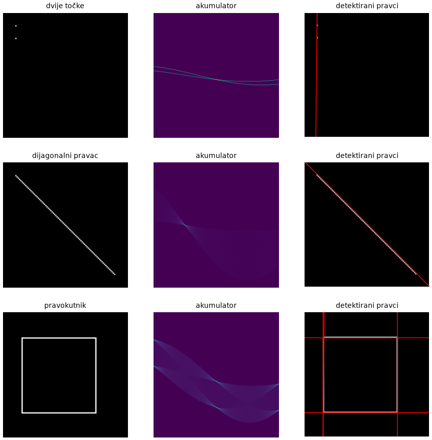
<br/><em>Slika 18. Akumulatori i detektirani pravci za sintetičke slike.</em>

**d) Sudoku.**
Na sliku `sudoku_gray.jpg` primijenite
svoj Cannyjev detektor iz prethodnog zadatka,
a zatim na dobivene rubove Houghovu transformaciju.
Nacrtajte `n = 20` najjačih pravaca
(mreža sudokua ima 10 horizontalnih i 10 vertikalnih linija).
Eksperimentirajte s parametrima:
rezolucijom akumulatora,
veličinom susjedstva za potiskivanje
te parametrima detekcije rubova.
Kako rezolucija po $$\theta$$ utječe
na to koliko su bliske linije mreže razdvojene?
Zašto se isplati koristiti različite veličine susjedstva
po osi $$\rho$$ i po osi $$\theta$$?

Primjer rezultata
(Canny `sigma=2.0`, `low=20`, `high=60`;
akumulator `num_bins_theta=180`, `num_bins_rho=400`;
potiskivanje u susjedstvu $$9\times21$$ ($$\rho\times\theta$$)):

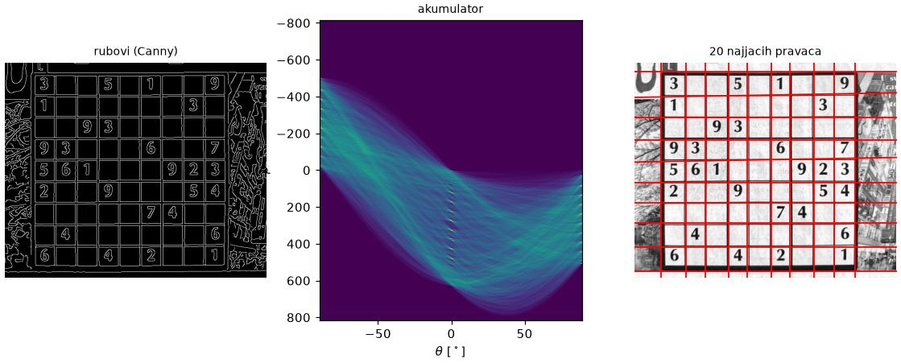
<br/><em>Slika 19. Rubovi, akumulator i 20 najjačih pravaca za sliku sudokua.</em>


**e) Bonus: glasanje ograničeno smjerom gradijenta.**
Prilikom detekcije rubova izračunali smo
i smjer gradijenta u svakom pikselu.
Gradijent je okomit na rub,
pa je za rubni piksel najizgledniji pravac
onaj čija je normala paralelna s gradijentom.
Proširite funkciju iz zadatka b)
tako da prima i polje kutova gradijenta
te da svaki piksel glasa samo za kutove
$$\theta$$ unutar $$\pm 5^{\circ}$$
oko smjera gradijenta.
Pripazite na to da `np.arctan2` vraća kutove
u rasponu $$[-\pi, \pi]$$,
a $$\theta$$ je definiran na $$[-\pi/2, \pi/2)$$.
Usporedite akumulatore i detektirane pravce
s izvornom implementacijom.

Primjer:

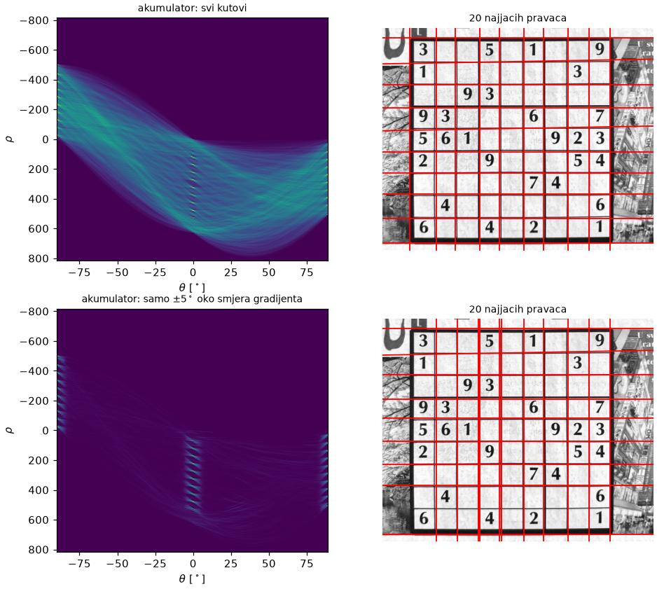
<br/><em>Slika 20. Akumulator i detektirani pravci bez ograničenja i s ograničenjem glasanja smjerom gradijenta.</em>
