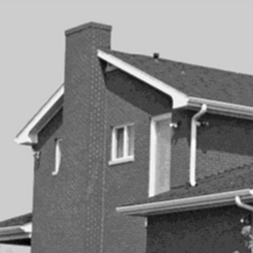

# Druga laboratorijska vježba: detekcija kuteva i rubova u slici

Jedan od osnovnih postupaka računalnog vida
je detekcija značajki - odnosno istaknutih dijelova slike.
Detekcija značajki osnova je za rješavanje mnogih složenijih problema računalnog vida poput: praćenja, slikovnog pretraživanja, uparivanja slika i dr.
Istaknuti dijelovi slika često odgovaraju kutevima i rubovima objekata u sceni. 
Stoga ćemo u ovoj vježbi razmatrati dva algoritma: Harrisov algoritam za detekciju kuteva ([članak](http://www.bmva.org/bmvc/1988/avc-88-023.pdf), [wiki](https://en.wikipedia.org/wiki/Harris_corner_detector), [opencv](https://docs.opencv.org/3.4/dc/d0d/tutorial_py_features_harris.html)) i Cannyev algoritam za detekciju rubova ([članak](https://ieeexplore.ieee.org/abstract/document/4767851), [wiki](https://en.wikipedia.org/wiki/Canny_edge_detector), [opencv](https://docs.opencv.org/4.x/da/d22/tutorial_py_canny.html)).
Implementacija ovih algoritama dostupna je u gotovo svim programskim bibliotekama za računalni vid, a kako bismo ih bolje razumijeli u okviru ove vježbe razvit ćemo vlastite implementacije. 

Ove upute fokusirane su na programsku implementaciju u Pythonu, a za pripremu i teorijsko razumijevanje algoritama možete se koristiti prezentacijom s predavanja ili gore navedenim poveznicama. Prilikom implementacije nećemo se koristiti bibliotekom opencv, a od pomoći će nam biti biblioteke:
[PIL](https://pillow.readthedocs.io/en/stable/), [scipy](https://scipy.org/), [matplotlib](https://matplotlib.org/) te [numpy](https://numpy.org/).

Prilikom razvoja, naše algoritme testirat ćemo na jednostavnijoj slici koja prikazuje logo FER-a, te u svijetu računalnog vida popularnoj slici kuće.


<!--  -->


## Harrisov detektor kuteva

Implementaciji Harrisovog algoritma za detekciju kuteva pristupit ćemo kroz niz koraka.

### 1. Učitavanje slike

Sliku u obliku višedimenzionalnog [numpy polja](https://numpy.org/doc/stable/reference/arrays.html) možemo učitati na sljedeći način:
```
from PIL import Image
import numpy as np
img = np.array(Image.open("path/do/slike"))
```
Zadaci:
- Provjerite koje su dimenzije tenzora `img`. Koja je visina, a koja širina slike?
- Ako je slika u formatu RGB, pretvorite je u sivu sliku uprosječivanjem po kanalima.
- Koja je minimalna, a koja maksimalna vrijednost intenziteta u slici?
- Ispišite na ekran intenzitete gornjeg lijevog isječka iz slike veličine $$10\times10$$ piksela. Umjesto for petlje, koristite *slicing*.
- Izvršite naredbu `print(img.dtype)`. Koji je tip podataka u polju `img`? Kako bismo izbjegli preljev u budućim operacijama, prebacite `img` u `float` (upute: koristite [ndarray.astype](https://numpy.org/doc/stable/reference/generated/numpy.ndarray.astype.html)). Još jednom provjerite koji je tip podataka u polju `img`.

### 2. Gaussovo zaglađivanje

Gaussovo zaglađivanje slike provest ćemo funkcijom [gaussian_filter](https://docs.scipy.org/doc/scipy/reference/generated/scipy.ndimage.gaussian_filter.html) iz `scipy.ndimage`. 

Zadaci:
- Prikažite rezultate gaussovog zaglađivanja za različite vrijednosti argumenta `sigma`. Kako vrijednost toga argumenta utječe na rezultat? Za prikaz slike možete koristiti funkciju `imshow` iz `matplotlib.pyplot`.

Primjer gaussovog zaglađivanja za `sigma=5`:


### 3. Izračun gradijenata

Za izračun gradijenata koristit ćemo se funkcijom [ndimage.convolve](https://docs.scipy.org/doc/scipy/reference/generated/scipy.ndimage.convolve.html).
Vrijednosti konvolucijskih jezgri za izračun gradijenata po osima x i y postavite prema [Sobelovom operatoru](https://en.wikipedia.org/wiki/Sobel_operator).

Zadaci:
- Prikažite x i y gradijente slike.
- Izračunajte druge momente gradijenata x i y.

Primjer gradijenata po osima x i y:


### 4. Sumiranje gradijenata u lokalnom susjedstvu

Prije izračuna Harrisovih odziva potrebno je u svakom pikselu izračunati karakterističnu matricu.
Primijetite da elementi matrice ne odgovaraju vrijednosti momenta u tome pikselu, nego sumi momenata u njegovom susjedstvu. 
Veličina toga susjedstva je jedan od parametara algoritma (tipične vrijednosti su 3, 5, 7...).
Jedan način za izračunati te sume je koristeći for petlje, *slicing* i redukciju sumom. 
Međutim, primijetite da to zapravo odgovara konvoluciji s odgovarajućom jezgrom.

Zadaci:
- Inicijalizirajte odgovarajuću konvolucijsku jezgru i pozivom `ndimage.convolve` izračunajte druge momente gradijenata sumirane po lokalnom susjedstvu.

### 5. Izračun Harrisovog odziva

Harrisov odziv u svakom pikselu odgovara razlici između determinante matrice i otežanoj kvadriranoj sumi elemenata dijagonale te matrice.

Zadaci:
- Koristeći rezultate prethodnog koraka izračunajte Harrisov odziv u svakom pikselu.
- Slikovno prikažite Harrisove odzive.

Primjer Harrisovih odziva:


### 6. Potiskivanje nemaksimalnih odziva

U ovome koraku cilj je potisnuti odzive koji bi mogli uzrokovati lažno pozitive detekcije.
To ćemo napraviti u dva koraka. Prvo ćemo sve odzive koji su manji od zadanog praga (eng. threshold) postaviti na nulu.
Ovaj parametar algoritma dosta ovisi o slici, pa ga je potrebno prilagoditi svakoj slici. 
U drugom koraku ćemo potisnuti sve odzive koji nemaju maksimalnu vrijednost u svome lokalnom susjedstvu.
Veličina lokalnog susjedstva je još jedan od parametara algoritma. 
Slično kao u konvoluciji, ovo možemo implementirati pomicanjem prozora centriranog u odredišnom pikselu,
te postavljanjem toga piksela na nulu, ako je njegova vrijednost manja od maksimalne vrijednosti unutar prozora.

Zadaci:
- Implementirajte potiskivanje odziva manjih od praga bez upotrebe for petlje.
- Implementirajte potiskivanje nemaksimalnih odziva unutar lokalnog susjedstva uz upotrebu maksimalno dvije ugnježđene for petlje.

### 7. Selektiranje k-najvećih odziva

Posljednji korak algoritma je selekcija k-najvećih odziva.

Zadaci:
- Dohvatite sve koordinate odziva različitih od nule koristeći funkciju [numpy.nonzero](https://numpy.org/doc/stable/reference/generated/numpy.nonzero.html).
- Izdvojite koordinate piksela koji odgovaraju k-najvećih odziva.
- Vizualizirajte rezultate algoritma iscrtavajući krugove u koordinatama detektiranih kuteva povrh zadane slike.

Primjer detektiranih Harrisovih kuteva:


Parametri algoritma: sigma=1, prag=1e10, k=0.04, topk=100, veličina_prozora_za_sumiranje=(5, 5), veličina_prozora_za_potiskivanje_nemaksimalnih_odziva=(14, 14)


Parametri algoritma: sigma=1.5, prag=1e9, k=0.04, topk=100, veličina_prozora_za_sumiranje=(5, 5), veličina_prozora_za_potiskivanje_nemaksimalnih_odziva=(32, 32)

## Cannyev detektor rubova
